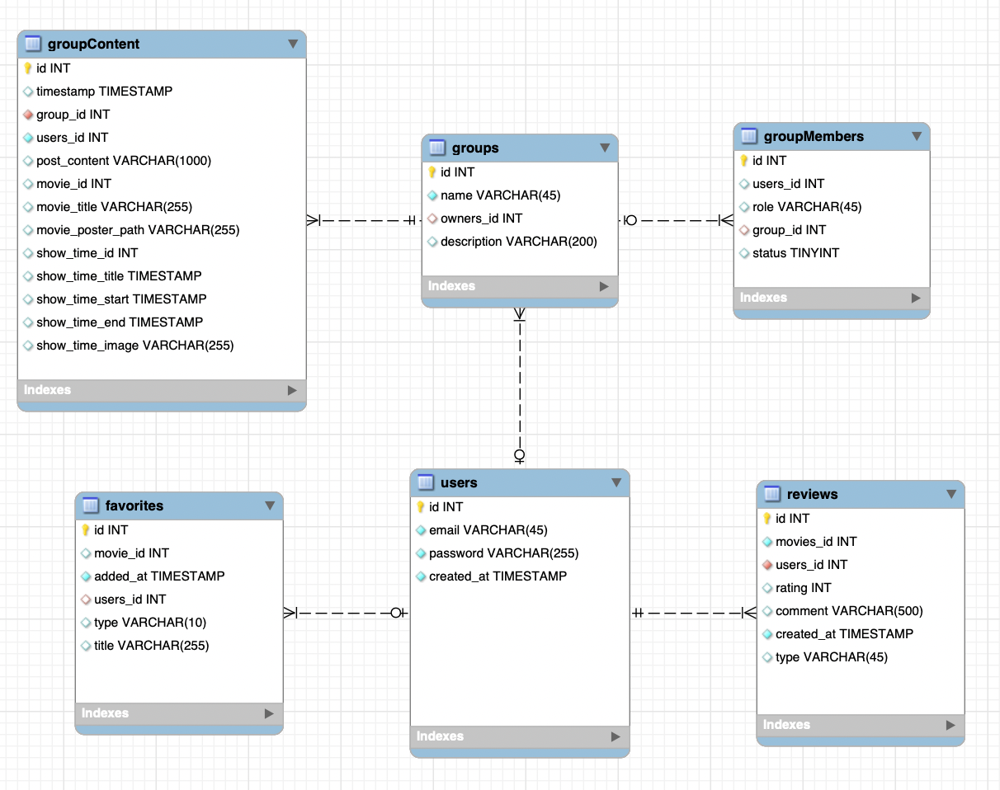

    

# Feature-Rich Web Application for Movies and TV Series

## About

This project is designed for movie enthusiasts, providing features to search for movies, join and interact in groups, and manage personal preferences.

## Technology Stack

- **React**: A library for building user interfaces, enabling modular components and dynamic, state-driven UI with a virtual DOM.
- **Express & Node.js**: Backend routes such as sign-in, sign-up, favorites, groups, and reviews are handled by Express, while Node.js ensures smooth server-side operation.
- **PostgreSQL**: Database for storing user data, favorites, groups, and reviews.
- **CSS, Bootstrap**: Styling and responsiveness.
- **APIs**:
  - **TMDB API**: Provides movie data such as title, release date, description, and cast.
  - **Finnkino API**: Supplies showtimes information.

## Project Team Roles and Responsibilities

- Yanwen He: Movies- and TVSeries Page, Showtimes,DetailPage, search/filter functionality
- Ke Zhang: SignUp, SignIn, DeleteAccount
- Suheda Sener: Reviews and Homepage
- Shromona Hossain: Homepage
- Thanh Nghi Vu Vo: Grouppage
- Seraj Shekh: Grouppage
- Robin Holzheuer: Profile-/Favoritespage, SharedFavorites-Page, UserListPage

## Database Structure

### Tables:

1. **Users**: Stores user data (email, password, created_at).
2. **Favorites**: Tracks users' favorite movies/TV shows (movie_id, users_id, title, type, added_at).
3. **Groups**: Manages user-created groups (name, id, owner, description).
4. **GroupMembers**: Tracks group membership (id, role, group_id, user_id, status).
5. **GroupContent**: Stores posts shared within groups (text, group_id, movie references, showtimes).
6. **Reviews**: Contains user reviews (movie_id, user_id, created_at, rating, comments, type).

### Relationships:
- Users are linked to groups, favorites, and reviews.
- Groups connect to group members and content.
- Favorites and reviews relate to users and media items.

## Interface Description

- **Home Page**: Search for movies/TV series and view content from TMDB endpoints.
- **Movie/TV Series Page**: View movie/TV cards and access detailed information (e.g., title, description, crew, cast). Authenticated users can provide reviews.
- **Showtime Page**: Filter showtimes by location, date, or cinema, with links for ticket booking.
- **Favorites Page**: Access and manage favorite movies/TV shows, share links, and delete accounts.
- **Groups Page**: Create, join, or leave groups; interact and share posts with members.
- **Authentication**: Sign up for new accounts and sign in for existing users.

# Application Installation Instructions

## 1. Clone Repository from GitHub

 `git clone https://github.com/AWA-Project-Group-1/MovieApp-Group-1.git`

## 2. Database Setup
Create a new PostgreSQL database  
Import the SQL schema from ./backend/db.sql into the new database  
`psql -U your_username -d your_database_name -f ./backend/db.sql`

## 3. Environment Variables Configuration

### Backend (backend/.env)
`
PORT=the_port_number_your_backend_server_is_running_on
DB_USER=your_database_username 
DB_HOST=the_host_of_your_database (e.g., localhost if running locally)  
DB_NAME=the_name_of_your_database  
DB_PASSWORD=your_database_password 
DB_PORT=the_port_your_database_server_is_running_on (e.g., 5432/5435)  
JWT_SECRET=a_secret_key_used_to_sign_JWT_tokens_for_authentication`

### Frontend (.env)
`
REACT_APP_BASE_URL=https://api.themoviedb.org/3
REACT_APP_API_KEY=your_tmdb_api_key
REACT_APP_BACKEND_URL=http://localhost:DB_PORT`

## 4. Running the Backend Server
`cd ./backend`   # Navigate to the backend  directory  
`npm install`    # Install dependencies  
`npm run start`    # Start the backend server

## 5. Running the Frontend Server
`cd ..`  # Navigate to the frontend directory  
`npm install`    # Install dependencies  
`npm start`    # Start the frontend server

# Link to a working application on the internet

Link to the website: [ NordFlix](https://green-bay-0f0301810.4.azurestaticapps.net/)

